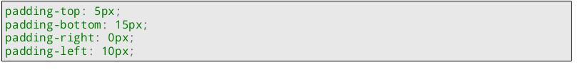
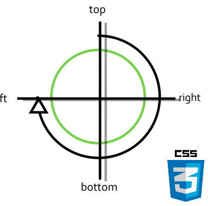
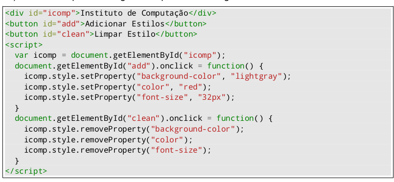

# lista 1

### Questão 01

-Apesar de termos algums atributos colocados em lugares diferentes como as tags: meta dentro do body, e não estando
dentro do escopo da da tag <head> o principal erro de sintatico é não especificar a unidade de medida que será usada em
width e height --> errado

Solução: por padrão ao usar o width e height sem a unidade de medida, a unidade de medida padrão eh pixel(px), então eh
a tag meta dentro de <head> mesmo!, este seria o erro sintático?

### questão 02

A importancia se da devido ao browser poder reservar o espaço que a imagem ocupará na tela mesmo antes de carregá-la,
evitando que assim que a pagina seja carregado primeiro e as imagens depois o que pode causar mudanças no layout
esperado de uma página

### Questão 03

Feita em código:

**OBS: algum texto acima da tabela -> usar a tag <caption>**

### 4) Descreva o que são estilos inline, estilos embarcados, e estilos externos. Escolha um dos três tipos de estilo e demonstre sua utilização em um código HTML/CSS.

**-Estilo Inline:** São definidos diretamente dentro dos elementos HTMl usando os atributos, e são aplicados apenas ao
elemnto especifico que estão definidos

**-Estilo Embarcados:** São definidos dentro do escopo da tag <head> do doc HTML, e concebidos dentro da tag 

**-Estilo Externo:** Semelhante ao embarcado, porem é definido em um arquivo separado no qual é vinculado ao HTML usando a
tag  <link>. São aplicados a todos os elmentos do documentos nos quais é feito a referencia.

<link rel="stylesheet" type="text/css" href="styles.css">

Documento css:

body {
font-family: Arial, sans-serif;
}
h1 {
color: green;
}
p {
font-size: 18px;
}

### 5) Qual a diferença entre unidades relativas e unidades absolutas, usadas como medidas de tamanho na linguagem CSS? A unidade em é relativa ou absoluta? Como essa unidade é usada?

**Unidadses Absolutas** - Unidades de medida que são fixas e não podem de outros elementos ou algum contextos. Representam tamanhos especificos e independem da resolução de um dispositivo. **Exemplo:** px, cm  etc

**Unidades Relativas:** medidas que são relativas a outra medida, como por exemplo um elemento pai ou ao contexto de uma página. Contribuem para um layout mais adaptavel , fluido e relativo.

**Unidade em:** Unidade relativa ao tamanho do elemento pai, se algum elemnto usar 2em ele tera o dobro do tamanho da fonte do pai

### 6) Considere o escudo CSS abaixo (à esquerda), que é uma imagem PNG com fundo transparente de nome escudo.png. A partir desta imagem, crie uma página Web semelhante à página da direita.
Feito em codigo 

### 7) De que forma as 4 declarações CSS abaixo podem ser representadas através de um único comando CSS?

O padding sega a ordem horaria: top, right, botton, left

para fazer uma unica atribuição ficaria:

padding: top, right, bottom, left 

### 8) Analise o código HTML/CSS e a página resultante abaixo. Que tipo de seletor CSS pode ser usado para selecionar, de uma única vez, os dois trechos com borda mostrados na página?

a {
    comandos
}

### 9) O que é tipagem dinâmica de variáveis, adotada pela linguagem JavaScript? Escreva um breve código que demonstre essa característica da linguagem.

Os tipos das variáveis são associados a **valores**, e **não as variáveis em si**. *Just like python*

let i = 1;
i = "a String";

type of para dizer o tipo e exemplicadr

### 10) Descreva o que faz a seguinte sequência de código:

-- easy 

### 11) Cite duas vantagens que o método externo, usado para incluir código javascript sobre uma página, possui sobre o método embarcado.
Não sei dizer qual o correto

### 12) A função window.alert(string) é usada para apresentar uma caixa de alerta com o conteúdo da string passada por parâmetro. Construa uma página HTML contendo um único botão. Quando o usuário clicar nesse botão, deverá ser exibida uma caixa de alerta com o texto Botão Presionado. Use o método addEventListener para programar o evento click.

*--Feito em codigo!*

### 13) Qual é o resultado da execução do código abaixo? Esse resultado sofreu a influência de hoisting?

### 16) Na linguagem Javascript, qual é a diferença entre == e === ? 
**==:** Compara apenas o conteudo sem levar em consideração a tipagem
**===** Faz a comparação levando em conta tipagem do objeto 